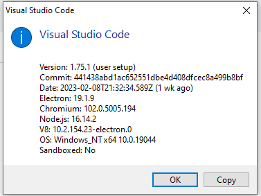

# bug_vscode_foam_rg

small repo to reproduce vscode foam extension bug on rg processes

## Steps to reproduce VSCode foam extension rg process bug

### Test environment

- windows 10
- python==3.9.13
- VSCode Version 1.75.1



see image in `./vscode_version.png`

## Steps to reproduce minimal example

1. Clone repository https://github.com/simeld/bug_vscode_foam_rg.git
2. Globally enable foam extension in vscode:
   https://marketplace.visualstudio.com/items?itemName=foam.foam-vscode
3. Initiate virtual environment in terminal

   ```console
   $ python -m venv env
   ```

## Resulting behaviour

- vscode spawns massive amounts of rg processes which take up all memory (and
  cpu)

  

  see image in `./rg_processes.png`

## Cause

- The cause of this behavious seems to be the foam extension trying to search
  the entire virtual environment folder `.\env\`

  - Running the below command in powershell
    ```powershell
    $ (Get-Process rg)[0].CommandLine
    ```
    returns:
    ```powershell
    "c:\...\Microsoft VS Code\resources\app\node_modules.asar.unpacked\@vscode\ripgrep\bin\rg.exe" --files --hidden --case-sensitive -g **/* -g !**/.git -g !**/.svn -g !**/.hg -g !**/CVS -g !**/.DS_Store -g !**/Thumbs.db -g !/{**/.vscode/**/*,**/_layouts/**/*,**/_site/**/*,**/node_modules/**/*,**/.git,**/.svn,**/.hg,**/CVS,**/.DS_Store,**/Thumbs.db} --no-ignore --no-config --no-ignore-global
    ```

## Possible solution

- The rg process should adhere to workspace ignore files like e.g. `.gitignore`
  which include the `.\env\` folder.
